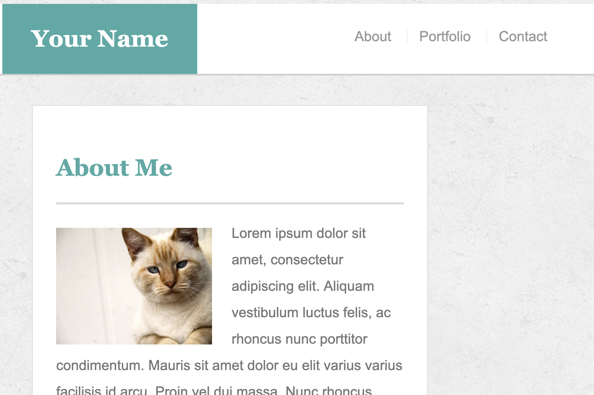

# Responsive-Portfolio
* This website consists of an about-me, a contact, and a portfolio page. The about-me page portrays information cleanly and concisely. The contact page offers a form for inputing contact information. The portfolio page dispays a gallery of works. This site utilizes media queries in order to achieve a responsive design for multiple displays of differents sizes.

[Click here to check out the site!](https://gljacobs.github.io/Responsive-Portfolio/)

## Technologies used:
* HTML 
* CSS

## Author: Gabriel Jacobs
